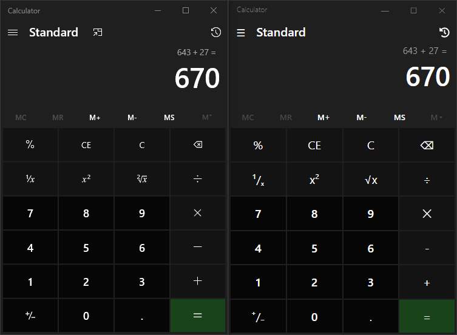

# MS Calculator Clone

Clone of the Microsoft Calculator

# Roadmap

1. &#x2705; Start making look like calculator
2. &#x1F532; Finish basic CSS
3. &#x1F532; Add some functionality, such as side menu
4. &#x1F532; When CSS is finished, add themes
5. &#x1F532; Add basic calculator functions
6. &#x1F532; Add memory
7. &#x1F532; Add history
8. &#x1F532; Fix fonts
9. &#x1F532; Add custom SVG instead of unicode
10. &#x1F532; Other calculators
    1. &#x1F532; Support
    2. &#x1F532; CSS
    3. &#x1F532; Functions
    4. &#x1F532; Graphing Calculator
       1. &#x1F532; Add functionality
       2. &#x1F532; Optimize
11. &#x1F532; Add extra features
    1. &#x1F532; Think of extra features

### Created by [darcy](https://github.com/darccyy)

